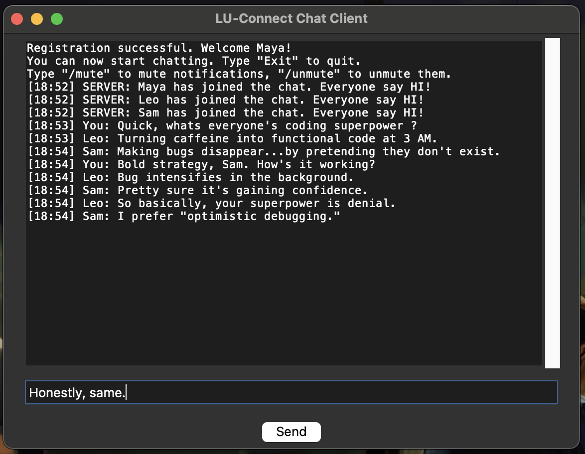

## Multithreaded Chat Messenger



This program focuses on implementing a client-server architecture using concurrent programming to handle multiple concurrent connections efficiently.

## Features
- Clients can Register and Login
- Client credentials are encrypted and stored in SQL database
- Queue system (currently set to max 3 clients at a time)
- Clients in queue will be notified of their queue number and waiting time
- Clients are able to send and receive text messages concurrently without blocking
- Messages include timestamps (both sent and received)
- Messages are stored in the SQL database
- Client who receive a message are notifed via a notification sound
- Notification sound can be muted using /mute or unmuted using /unmute
- Clients can exit the chat using /exit

## Prerequisites
- Python3

  ```zsh
  brew install python
  ```

- tKinter

  ```zsh
  brew install python-tk
  ```

## How to run
1. Open terminal and run server.py
```zsh
python3 server.py
```
2. Open another terminal and run client.py
```zsh
python3 client.py
```
3. Repeat Step 2 for as many clients as you want to join the chat room.
